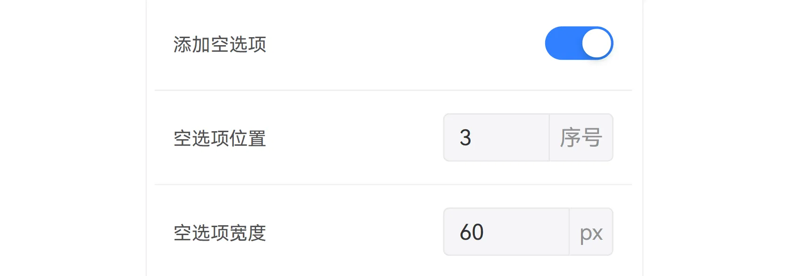

# 标签栏

 一般存在于屏幕底部，不吃不喝就在那呆着，你还会经常戳它。

<h2>样式</h2>

标签栏提供了很多自定义选项，你可以设计出独一无二的标签栏。

<h2>自定义选项</h2>

***添加：*** 点击底部的 `+` 按钮添加新选项。
***键：*** 选项的文本。
***值：*** 选项的图标，填入 SVG 代码 或 图片链接。

如果需要 ***选中时*** 和 ***未选时*** 显示不同的图标，可以在 值 里面填入两个图标内容，中间用英文逗号分开。
格式：`图标1` , `图标2`
例如：`https://...png` , `https://...png`
第一个是未选时显示的图标，第二个选中后显示的图标。

<h2>空选项</h2>

如果需要在标签栏中添加一个按钮或其他东西，可以开启`添加空选项`开关。
开启后，标签栏就会空出一个位置留给你自由发挥。

  
  

<h2>红点提示</h2>

调用 ***红点提示*** 积木，给指定名称的选项设置提示。
如果只需要小红点，可在提示文本中输入英文句号`.`。

  
  

<h2> 下载</h2>

请点击ZIT-CoCo-Community上方的下载按钮

---
文档作者：琦琦  
Markdown排版：小圳  
在排版时可能对内容进行了改动  